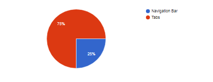
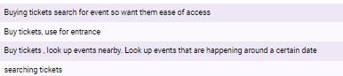
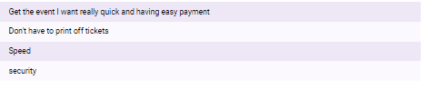
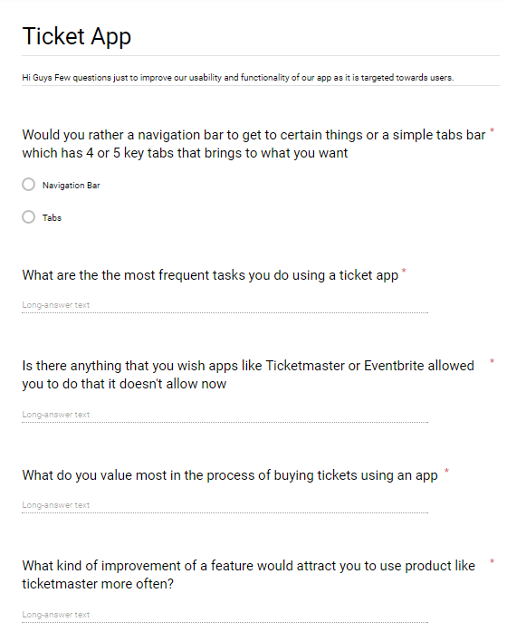
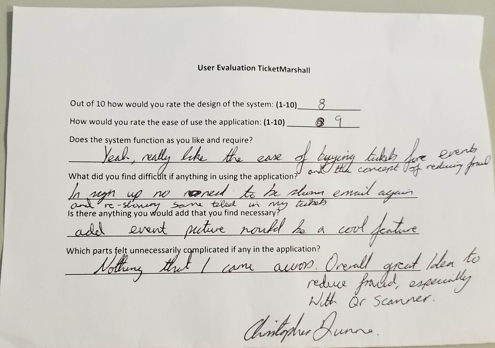

# TicketMarshall-Testing

We began to document some of testing we completed and feedback received from people because user feedback was huge for our application concept. As it’s an application that dealt with people using their money trusting our app was a big goal for us. We went into such detail when looking at the design from the way a human mind works with colors to design cues. What a customer actually needs compared to what they think the want.
Another big thing was we knew testing is huge in app development so we wanted to put lots work into it. By documenting it be be easier for you to see what testing and user evaluation we did to improve our cross platform application as a whole. Everything we recorded is available on Gitlab under the directory name “Testing&Feedback”.


## Firebase Testing

As we were using firebase for our database we decided to test the database from the get go. We used firebase test labs wit an android apk to see if our database worked correctly. With one operation, we could initiate testing of your app across a wide variety of devices and device configurations. We documented some of these tests and put together activity log of how the database works in activity map and also documented our log files for logging in and signing up and how firebase authenticates users correctly. This pdf can be found under "firebasetesting.pdf"

## Unit Testing

This was a major factor in the creation of this system. The JavaScript code was used to communicate from the database to the website and application. When creating the JavaScript code we created simple Unit tests. These white box tests were given input values and then the output values of the code were checked. A sample case of this unit testing is when a user is signup we make sure the email is a valid email format and password is of at least 6 characters. If not a red line to represent incorrect and throw an error message. Before writing the tests we would collect the expected output values. Then in the code we would use an:


``` javascript
error => {
	this.loading.dismiss().then(() => {
		const alert: Alert = this.alertCtrl.create({
			message: error.message,
			buttons: [{ text: 'Ok', role: 'cancel' }]
		});
		alert.present();
	});
}
```
What this does is catches the error and displays the error message which you place in the HTML: 

``` erb
<ion-item class="error-message" *ngIf="!signupForm.controls.password.valid && signupForm.controls.password.touched">
<p>Your password needs at least 6 characters.</p>
</ion-item>
```

It is the same thing as an assert in Java which we learnt in comparative languages. It just we could integrate the above with auth(). In firebase using JavaScript. 

function to compare the actual outcome of the code. Failure of the assert condition indicated errors in the code and resulted in changes being made to the code. Passing tests resulted in the code being used and developed further. The code was then eventually integrated with other files of code.


## Integration testing

After the initial unit testing, the code was usually integrated into the system. This meant the code was integrated in with other files. Integration testing was sometimes completed using karma running run native JavaScript tests

```
echo '=== Running Tests ==='
npm install -g karma
karma start --single-run

if [ $? -eq 0 ]
then
  echo "Karma Tests Successful!"
  export KARMA_TESTS=1
else
  echo "Karma Tests Failing." >&2
  export KARMA_TESTS=0
fi
```

## Exploratory testing

Traditional testing follows a fairly simple model in which there are test cases written beforehand for all the possible use cases and then, after the test cases are final, they are executed until they all pass.Exploratory testing follows a different approach and we felt to improve app as a whole we would deploy this approach as ionic framework really helped us in this side of testing
In exploratory testing, the test cases were written by the us simultaneously, as they are executed. This was really good as it found more critical bugs than the more traditional form of testing and really helped us to hone in our app to remove any major bugs.

## Automated Testing

The use of automated testing allowed us to run multiple tests daily. These tests were much more efficient than running them manually every day. The tests could be run in the background while other sections of the project were worked on. By the submission of the project we had multiple automated tests which tested the application.
These tests were used to test the functionality of the application. The tests ranged from checking that some pages could not be accessed by certain people to checking functionality such as selecting a specfic event.
To create E2E tests we used a new tool called Protractor which will allow us to simulate user behaviour, and it will run our tests for us automatically through a browser where we seen the actions being performed in real time. 

## Application Integration Testing

With our system using both on Android and iOS, the integration of the two was a key step for us. To ensure they would work well together we connected them to the same firebase database. Once connected we underwent ensuring the information on the application was the same as on two platforms. This also included creating new data so we created an account on one platform and one on another and both went to the same database.

## System Testing

Once we had a fully functioning mobile application we performed the full system test. This system test used each section of the application. The results were very positive and showed no errors. All sections worked coherently and successfully together.

### Functionality using iOS and Android platforms
#### ***We Tested:***

* Logging in as an event organiser: success
* Logging in as customer to buy tickets: success
* Not being able to login if have no account registered: * success
* Registration as an event organiser: success
* Registration as a customer: success
* Adding user to database: success
* Creating an event and adding it to database: success
* Catching invalid input for email and displaying correct message: success
* Catching invalid input length for password and displaying correct message: success
* Deleting users from the database as admin: success
* Seeing all events as a customer: success
* Seeing just your events as an event organiser: success
* Change customer password: success
* Change event organiser password: success
* Change profile info like date of birth and name: success
* Log out: success
* Have unique QR code for each “customer” user: success
* Scanning QR codes: success
* Number of correct tickets being shown in scanned QR result: success
* Deny entry information being shown when QR scanned if no tickets are associated with an event: success
* Validating tickets through the QR code: success
* Changing profile information and database being updated from this: success
* Reset password: success
* Not being allowed to buy more than 4 tickets at a time: success
* If only 2 tickets left not being allowed buy 3 or 4 tickets: success
* “Customer” user only gaining access to customer pages when login: success
* “Event organizer” user only gaining access to event organizer pages when login: success
* Displaying message that tickets sold out if no more tickets and not let customer users able to buy: success
* Passwords being secured using bcrypt and passwords being salted : success
* Being able to search by venue, name or genre in search bar: success
* Able to access FAQ,Privacy Policy, about us and being able to contact TicketMarshall team: success
* All back buttons working and redirecting to previous page: success
* When creating event the date only goes forward in time from 2018: success
* Adding an event picture using the camera: success
* Regonsing a valid credit and debit card: success
* Logging in as an event organiser: success
* Correct default image associated with what genre picked in creating an event: success

## Manual Testing


Manual testing was a big part of our project as we could use the benefits of ionic live reload. Our best way of testing out application manually on emulators and real devices. The good thing with ionic was we could emulate iOS and Android simultaneously so could test both at the one time.  We would watch the tool to make sure there was no errors or bugs in our code. This proved to be very useful and efficient as we were able to catch bugs and errors early and get a clear understanding of what our code was doing. Ionic ran in real-time so once you saved a code it refreshed the emulator on both iOS and android. This was really good for testing as caught and displayed any errors. This meant we could get to the issue straight away.
As using JavaScript, we would we would console.log statements to ensure the variable been passed would be correct and how we wanted it to be.


## Usability Testing - User Testing & Feedback

In the early stages of the app we also done a survey with different people just get some open ended feedback so could get some early opinions on what users wanted so we knew what functionality we wanted to go towards. Below is some of the survey results we got early on to get a blueprint for what users really wanted.

#### To use Tabs or a navigation bar



#### What are the most frequent tasks you do using a ticket app



#### What do you value most in the process of buying tickets using an app



#### Early User Feedback Form



Although the survey was good for early devlopment we needed to do involve users at each stage to get their opinions. At each stage of development we included users of different ages to test the system and give their opinion.
By having real potential users test the system we were able to discover more bugs, especially ituations which we would not consider. When all functionality was done we asked users for their feedback. We asked them to complete some simple actions. An example action was asking a user to create an event and to log in to the appliction. We asked them to complete some simple actions. An example action was asking a user to log in to the application and search by genre. Another example was an event orgainser user to add an event picture. We also asked them to scan tickets withut any instructions. After the completion of the tasks, we were able to identify problems and sections which may be confusing or inefficient.


As we wanted as much realistic users we got a peroson who works in running events to use the application too. We asked them to set up an account and create an event. After they completed the tasks we were able to identify problems and sections which may be confusing or inefficient. Also got great feedback towards the look of the application and ease of use.
After completing the testing, participant would be asked to give their opinion of the overall system through a series of questions. We asked test participants the following ***open ended*** questions:

##### Out of 10 how would you rate the design of the system: (1-10)

##### How would you rate the ease of use the application: (1-10)

##### Does the system function as you like and require?

##### What did you find difficult if anything in using the application?

##### Is there anything you would add that you find neccesary?

##### Which parts felt unnecessary complicated if any in the application.



When all functionality was pretty much done we done user feedback to refine anything we missed and see how the app fared wit different types of users. Declan was lucky enough to work in 3arena Irelands largest indoor venue and asked the workers that scan tickets to use the app. They really liked the idea of built-in QR scanner and how secure it was.
Luckily Declans neighbor also organises small events in hotels and found that renting QR scanners is a huge cost that not needed. Our app resolved this with the built-in scanner. Also, she really likes the default pics as didn't need to hire a proper picture to be taken for a small events that cost margin is key factor. She did like the fact to have the option to add her own piture if needed though.

Through user testing and getting their feedback we were able to significantly improve our system. We valued their opinion because they are the actual users of the system. If it a system which they do not understand or not like they will simply not use it.
As a result we did listen to their opinions. Both the built in qr scanner and events creation were user suggestions. Users said the addition of these functionalities would greatly improve the system and increase its usability as it would be an application could be used in unison . The users’ opinion was also crucial in the design of the system. Before developing the user interfaces, we created some prototype layouts. We then showed these prototypes to users and got their opinion. This allowed us to develop a layout which fit their needs and requests. 

When it comes to reliability and trust, ***Blue*** is the best choice. Accordingly, the apps that people have to give their private information to use it. As we were handling payments and tickets we wanted users to trust our app and that we were aiming redce fraud and touts.
A lot of feedback given to us in relation to functionality additions was very ambitious. This was due to the fact that the users did not understand the difficulty of developing some functionality.


We also had some people with more technology knowledge test our system. We hoped that with their extra knowledge about how some certain stuff works that they would be able to break our system and find some bugs. This type of testing resulted in some bugs being found but nothing major.

