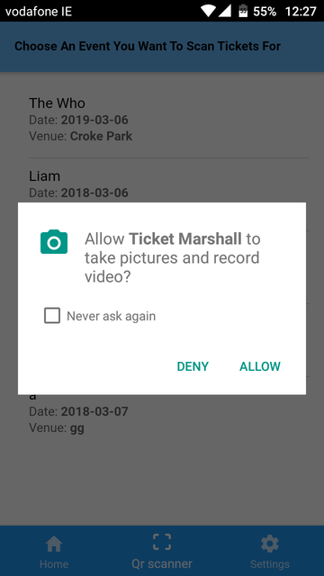

# Technical Specification


## **Table of Contents**
| **1 Introduction** |
| --- |
| 1.1 Difference between the Functional Specification					    2 |
| 1.2 Glossary											                    2 |
| 1.3 User Evaluation										                3 |
| 1.4 Testing									                        	3 |
| **2 System Architecture**						                		3 |
| 2.1 Database & Server							                			3 |
| 2.2 QR Code										                       	4 |
| 2.3 Android & IOS Application							            		5 |
| **3 High-Level Design**						                    	5 |
| 3.1 System Model								                        	5 |
| 3.2 Use Case Diagrams								                		6 |
| 3.3 Data Flow Diagram									                	8 |
| **4 Problems and Resolutions**					                		9 |
| 4.1 Events not updating										            9 |
| 4.2 Querying nested data								                	9 |
| 4.3 Slow implementation of ticket validation						    	10 |
| **5 Installation guide**	                                                11 |


## 1.Introduction
### What is Ticket Marshall

Ticket Marshall is a cross platform application created for event organizers to sell tickets to their events. It's purpose is to provide a secure, easy to use platform for events of all sizes. Both event organisers and customers use the same app. Creating an event takes minutes and buying a ticket takes seconds. The application provides the customers with a reciept of their ticket but not their actual ticket. Each customer is given a unique QR code which event organisers scan to check if the customer has a ticket to their event. This is extremely secure as no one can see the tickets, therefore no fraud or duplication.

### 1.1 Difference between the Functional Specification

Originally the application was going to provide a secondary market so people could resale unwanted tickets at face value. Recently there has been a change in the markets perception of resaling tickets. This is due to the amount of ticket touting taking place. Due to this change we have decided to follow the market and not allow resale of tickets. This is in the best interest of all our users and will keep the application marketable.
Ticket resale sites could face court over consumer law concerns due to recent law changes in December 2017. Becasue of this it was a no go to do a secondary market. 

### 1.2 Glossary

Cross platform application : application which can be implement on mutliple platforms, in this case IOS and android. 

QR code: Quick Response Code, a two dimensional barcode which can store data. 


Ionic : is a complete open-source SDK for hybrid mobile app development.  Ionic is a framework which is a set of CSS classes and a JavaScript library, build on top of Cordova with AngularJS.

Ticket touting: The act of reselling tickets at rate greater then face value.

Firebase:  A mobile and web application development platform developed by Firebase, Inc. in 2011, then acquired by Google in 2014

Salt and hashes: a salt is random data which is appended to a password. This combination is then hashed. Hashing is a type of algorithm which takes any size of data and turns it into a fixed-length of data. This is an extremely secure method for storing passwords.

API: Application programming interface, it is a set of clearly defined methods of communication between various software components.

IOS: Iphone Operating System , a mobile operating system created and developed by Apple Inc.

Hybrid application: An application built with HTML, CSS and JavaScript. Designed as a web application and uses native containers to view through a application window.


### 1.3 User Evaluation

This system involves two sets of users, customers of event tickets and event organisers. Each type of user interacts with the system differently so there are two different set's of user evaluations. During each stage of the design user evaluations were completed to ensure that the system's UI is "most user friendly". Here is a link to our user evaluations.

### 1.4 Testing

Ticket Marshall involves multiple seperate units and components, therefore this system involved multiple unit testings. Each of the pages of the application were individual tested, then their interactions are tested. Here is a link to our Testing "section".

## 2 System Architecture

### 2.1 Database & Server

Ticket Marshall uses Firebase as it's database and server. Firebase provides both together and allows both IOS and Android user's data to be stored 1 database. This was a very important factor in the decision of which platform to use as our server.
Since Ticket Marshall is a cross platform application we decided to use the Ionic SDK for designing the application. Ionic and Firebase integrate very well, which made storing and querying data from both IOS and Android platforms more practical.


When a user signs up they are provide an email and password and this is stored under a UID. The user then tells the systems which type of user they are. Both sets of user's data is stored in one database but are differentiated by which 'UserType' they are. Using Firebase we were able to salt and hash every password to provide excellent security for our users. All registering users most also verify their email address's, this is a secuirty feature we added to further portect our users.


### 2.2 QR Code

Our system is designed to provide a secure and easy-to-use method for buying and selling tickets to events. Using a QR Code API we generate and evaluate QR Codes to validate a customer's ticketsto events.

When a user registers as a customer the API generates a QR Code which encodes the customer's UID. This QR Code allows the event organiser access the the customers tickets. An event organiser can create multiple events. The event organiser validates tickets to each event seperately. This ensures that only the event organiser for that event can manipulate the tickets to that event.

A function then checks for tickets in common between the event's tickets and the customer's tickets, counts them and then discards them from the customer's side.

 

### 2.3 Android & IOS Application

Our design proposal was to create a cross platform application which could run on IOS and Android platforms. A new technology used to develop such applications is a hybrid application. We decided to develop out application as a hybrid application. Using hybrid application technology allowed us to develop a single application which could be built on both platforms with minimal noise. Few configurations had to be made for each individual platform.
We used the Apache Cordova platform to provide the application with a consistent set of APIs to access device capabilities through plug-ins, such as the camera, which are built with native code. This meant that we could be writing our code in HTML,CSS and JavaScript. JavaScript was a new language to us so coding with it was a challenge, but we believe we met it.

## 3 High-Level Design

### 3.1 System Model


Our application's 4 main external modules and components:
 * 1  A camera module. It is accessed by cordova's camera plugin. The camera module is used for scanning barcodes and uploading images to events.  
 * 2  The internet. Having access to the internet is very important. The application uses the internet to communicate with the database. The database conatins all data for both the customers and event organizers. Not of the users data is stored locally on devices as we decided having a low impact on the devices memory was important.
 * 3  Our Database and Server. The database is a vital part of our project. It stores all the data for all our users. 
 * 4  We are using Stripe for our payment system. Stripe provides API's which process payments and stores the customers card details. This is important to use as it ensures our customers card details and secure.
 


### 3.2 Use Case Diagrams


 

Above are two use case diagrams containing possible actions by both sets of users. Using inheritance we were able to reduce the amount of code for common functions such as 'update profile'. 


### 3.3 Data Flow Diagram

#### Below is a Data Flow Diagram for the process of validating tickets:


The validation of tickets involves both a customer and an event organiser. The customer displays his QR code which the event organiser processes with the scanBarcode function. The scanBarcode function returns the customer UID. The application then sends the customer's UID, event organizer's UID and event's ID. The database then returns the customer's array of tickets, an array of tickets to the event and an array of events which the customer has tickets to. This is then processed by the ticketValidation function which displays the number of valid tickets on the event organisers phone and return the an array of valid tickets to the database to ensure they are not processed twice. 

## 4 Problems and Resolutions

Throughout the development of this system we ran in serval problems. Thankfully, thankfully through discussion and research we solved them. Below are examples of such problems.

### 4.1 Events not updating

__Problem:__ A customer view an event. The event page displayed that there was only 2 tickets remaining. The customer bought both tickets. When the customer went to the event page it still displayed that 2 tickets were remaining and had access to the purchasing function even though the event was actually sold out.

__Resolution:__ When the customer entered an event's page the event's details are loaded and displayed. Through viewing the database at realtime we discovered that it was being updated and was storing all the correct data. We then tried exiting the application and entering it again to discover the correct information was being displayed. We then figured out that the problem was that the page was not reloading, it was loading once and storing the information in cache.

The application was using a function to perform tasks when the page was first loaded:
```javascript
ionViewDidLoad(){}
```
We replaced it with a function which performed the same taskes but done so every time the page was entered:
``` javascript
  ionViewWillEnter() {
    console.log('Entering function Everytime!');
```

### 4.2 Querying nested data
__Problem:__ When trying to query nested data we ran into the same error over and over. ```[object] [object]``` We were not able to query a event's id or a ticket's id. This meant that we would not be able to validate the tickets.

__Resolution:__ The way we were attempting to access the data was wrong. We knew that data was there because we printed it out by using:
``` javascript
JSON.stringify(snapshot.val().id.genre);
```
We figured out that because it was nested data,that we had to have a nested snapshot. We also had to save the keys as variables and use the variables.
``` javascript
firebase.database().ref('/userProfile/').orderByChild('eventList').once('value', (snapshot) => {
      snapshot.forEach((childSnapshot) => {
      const name = "name";
      name: list.eventList[key][name];
```


### 4.3 Slow implementation of ticket validation
__Problem:__ When performing performance testing we realised that our ticket validation function ran at a time complexity of n^2. We knew that this was not good enough for events with 1000's of tickets.

__Resolution:__ Through printing to console each ticket being checked, we discovered that the function was checking every ticket of every event of that event organizer to compare to the customers tickets. When the event organizer clicked the scan function it was doing so for every event. We changed this so it would display the events and they could select whichever event they wanted to validate tickets for. To further improve the speed we introduced another the element 'myEvents' to the customers information. The validation method would first check this to see if the customer has any tickets to this event. This greatly improved the performance of the function.

## 5 Installation guide

### Android Installation

Ticket Marshall is available on both the playstore for android devices and appstore for IOS devices. For installation of our application the minimum version of android reqiured is 6.3.0 and the minimum version of IOS required is IOS 9.
When entering either stores search "Ticket Marshall". A link will be provided to download the application. After downloading the application the user must grant permissions for access to the camera.

    	 

Before beginning the installation, the user should ensure they have enough memory. The application will need at least ?? megabytes of space to be installed. Checking how much memory is available will vary slightly from device to device. The most common way to check is to go into “Settings” on the device. In “Settings” there is a “Storage” option. When “Storage” is tapped a new screen will open up showing the devices storage statistics. The user should be able to determine if there is enough free space within the device to allow installation. If there is not enough free space on the device users will have to create more space. The best way to do so is to either use an external memory storage system such as a memory card. If this is not a feasible option the user should uninstall some pre-existing applications or delete other information on the device such as images.

Once it is confirmed there is enough space, the user should go to the Google Play Store. To use the Google Play Store users must have a Google account created and logged in. If users do not already have an account please go to this link and create one, link: https://accounts.google.com/SignUp?hl=en. The user should then log into this account on the Android device. They should now be able to use the Google Play Store.
When in the play store, the user should use the search option at the top of the page to search for the application by typing in “TicketMarshall”. Users will be brought to a page which contains a list of results which match their search. If there is more than one result, users should find the application created by “DCU CA Apps”. This name is under the name of the application itself.

Once the correct application is found, users should select this application. They will be then brought to a screen where there is more information about the application. To install the application, users must touch the green “INSTALL” button. Touching this button will begin the download and installation of the application. A progress bar will show the progress of the installation.

The user will receive a notification when the installation in completed. The application should then be located in the devices applications. By clicking the applications icon and name users will be shown the loading screen followed by our login screen.

### iOS Installation

For iOS user should go to the app store. Users must have a AppleID created and logged in. If users do not already have an account please go to this link and create one, link: https://appleid.apple.com/account#!&page=create. The user should then log into this account on the Apple device. They should now be able to use the app store.
When in the app store, the user should use the search option at the top of the page to search for the application by typing in “TicketMarshall”. Users will be brought to a page which contains a list of results which match their search. If there is more than one result, users should find the application created by “DCU CA Apps”. This name is under the name of the application itself.

Once the correct application is found, users should select this application. They will be then brought to a screen where there is more information about the application. To install the application, users must touch the  “GET” button and then the "INSTALL" button. Touching this buttons will begin the download and installation of the application. A progress circle will show the progress of the installation.

The user will receive a notification when the installation in completed. The application should then be located in the devices applications. By clicking the applications icon and name users will be shown the loading screen followed by our login screen.