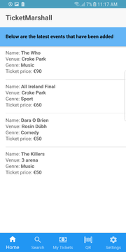
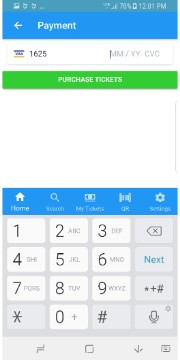
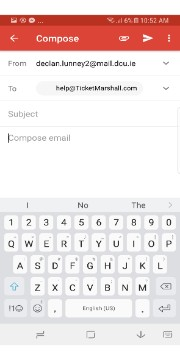

# TicketMarshall User Manual

 
**Available on iOS & Android**

 ![](data:image/*;base64,iVBORw0KGgoAAAANSUhEUgAAAMgAAADICAYAAACtWK6eAAAABHNCSVQICAgIfAhkiAAAAAlwSFlzAAAN1wAADdcBQiibeAAAABl0RVh0U29mdHdhcmUAd3d3Lmlua3NjYXBlLm9yZ5vuPBoAAA3tSURBVHic7dx9tFxVecfx7zP3BUICEYmQkiwgkIRYIgQS2i7TShOMgi0I2hdfqVi01VpLqUVb2gZfVimlS5Fqu1rsWu1CrK20SlEUeQlWImiMwGokxEg0mvfwEjBwk3sz8/SPfYY5czLzzMydublJ7u+z1l13zjl7n3PuvfO7s/c++xxzd0SksdJ4n4DIwUwBEQkoICIBBUQkoICIBBQQkYACIhJQQEQCCohIQAERCSggIgEFRCSggIgEFBCRgAIiElBARAIKiEhAAREJKCAiAQVEJKCAiAQUEJGAAiISUEBEAgqISEABEQkoICIBBUQkoICIBBQQkYACIhJQQEQCCohIQAERCSggIgEFRCSggIgEFBCRgAIiElBARAIKiEhAAREJKCAiAQVEJKCAiAQUEJGAAiISUEBEAgqISEABEQkoICIBBUQkoICIBBQQkYACIhJQQEQCCohIQAERCSggIgEFRCSggIgEFBCRgAIiElBARAIKiEhAAREJKCAiAQVEJKCAiAQUEJGAAiISUEBEAgqISEABEQkoICIBBUQkoICIBBQQkYACIhLoH+8T6IXFixf3AQNAeeXKlSPjfT5y+DhcPkHeDgwBd4z3icjh5XAJiMiYGLcm1mnLVk+1SuWMPgY3rrv3rM293r+ZvQl4SRtFK8CX3X2Lmb0OOCko68A33f2xwrFOAuYBM4HBQp1N7v7lrNxi4BW5fd3j7k9k22YCFwJ92fa17v6NbNs04BJa/702uPvXzexUYBlgLcoDbHP3L7VRbkI6oAFZsuT+/s1M+aCbXdYHc6Bkzj5OX7p6WwW+7gMDf/rDu87c0e1xzOxE4N87qPIh4HrgVlqH6hbgsuw4LwU+Q3rzNnszDgNHZK9vBBbltn0CuCp7fRvwi7ltNwHfyF5fAtzc6ocAngKmAVcCf9hGeYCKmfW7u7dZfkI5YE2s05esnrfFjn4Is48ZzAWeM+xbwGaH6QaXlUZGvj/7Vx+4tAeH62tdpGH5durly/wDcCnxf+r8P6Hi/vsAzOyV1IfDgU8H9Vodq5N/fGpmBw7IL2fGxauPcuMOh4XAD7HSeetXLDx23X3nLP7BfQtn7rPSKcBXgGk4/3nKov84p8tDDo+yfDsjYCMAZtYPvKFH53JlYfmr7v6DNuoVDWXf93ZQZ98ojjNhHJAm1uTdXAfMxnh4Uv/Arzx615nP57dvuPfsjcCvz126+pPA+73Ev82f/+GFa9Ys7/SNDoC7bzezJdSaS+8mte+rhoC3ZK8rwDez1xcAM4BXAX9c2O3vAM8C38uWTyENLefdBfwL9UHbGp1r1n8pBu3GqA7wTIM6ANW+3N8A95M+2SYBnyuU+yzwX9nrHWpeNTfmAZnzum8fY/S/D9jrVnpbMRx5fuTUq3lh6Hxg/q6+KReT2uWj4u73V1+b2bLC5n2NOqbuvgpYZWZHNdjlV919Z2652BkHuN7dV3RwmjOA5dQ3obaQ3tydGAFWufswpH8QwO0AZnZMg/KPqWPenrFvYg31nZMd58H195z9WFR0/Z2z97pzC4C7LYrKHqQ6ba68EXhnYd2JwI/M7OKg3rHAitzXA6S+kPTYmAfEStkb3fluWxXcq+UOxYD0ygzgLzqsM2ksTmSiG/uApGFHvMRT7ZTv6+urlps2Zid1aDjXzI7roHzTpquM3mExF+sg0s6Fuby7qXWgLwB+u7C9UT8H0vWOV+eWR4C1HR5b2qCA5JjZDOBlwMkNNs83s6eBJ9x9N437G+8wsyHqR7GedPdNTQ651t3/NTv2FvYPSGRPYXmumW1392c62Ie00POAzPvllUfvHRicXDtA32Qzx7Aps5asmt6qfqlcrjYr+o+fdfV0+DEvPL+T5/esH/HnNrXVTOvC94Djm2y7L/v+GeBdwEagTP0I1OXZV97PgEYjSd04jsafGD8lniojHeppQE5f+vD5PnjknQN1TYNsiN39mgErXdNqHxV7sZVyBv3lrSN7SlDZx2BlkL6+Iz5SLu9d3stzLmino3sUgLvvNbN7gde0KD+5xfZe6nUQJ7yedtIrVjmX5u3mrrnXTcfoqGphudJmuUbydd8JPNhB+eg8Gh27EmxrdaxonS4Mtmmi9EH+GdhJrRO9oUm59wOzgv046Wp5WnDfDLzSzM4FXk7j2bw/yb2+ljTdprqv/MW67wB/Tm1i47PZBT+AO4G/pPXfa7/pKe6+28zeC5yQrarQxQXYieawDoiZvRmYmi1uBv7H3XcUyryWWigc+Ly7P14ocxzwetKbf4GZLcg2DWf7XAWsypWfAywlBXLQzH4/t7tN2bk84u4vTkNx92eB67L604GFZvYuan2cJ7PvZeAOd9+WlT2b2kTHo81svruvyZ3LW7OfaxupY/95d6/r4JvZOcC57D8Kt8Pd/7uwjsJtAWXg9uLvtUGdk0kjddVjvDid/2DW04CUsKccX9fNPiyNIr20sPo5YKuZ/bTt/Zgdz/5zkN4OnJcr82rga4Uy1U543qdpPsL0BeC3CuuuBN7b4hSHzOyP3L1uGruZLQf+jNonSSPV6fkAHwV+Lbftc8Bbs33NJM27ynuC2twzzGwqaVr9lEYHMrNLG0xLKd4WMECa2Ry5gvqLn2uBn29RZ9z1NCDr7j3nZtq7b6GpRYtWD+wssYXahcJKaXj41L27N3Q6gtVoivirzOz17n67mZWAG1rVy25WiqZxXGJm09z9ydy6dqanTwJuMrMvVed4ZYG9to26fU1et9rWaN2baBKOzBXUNwVbHbOZ0dQZdz0NyGnnPTKnv1Q+o5t9VCYPzWCIY3OrSuXBwfccMXnWmuEXNm13H2nVKW7lejP7Cmk274JWhYG3EQ88DJD+Y39yFOdyJOkOw+oQ8tI263Uynb2V322x/QIz+7l8c3Ai6W0Tq7/8RvfUjh6tRsMrBh/FDLPSXaR2bDdOBz5O+5P7im+gm0ifbm/JrbucOCAPABdlx36Q+rZ+fhj4BOptBn6P1M6vKgMPtTzrNpjZK0h9j6ph0sjcX1PrY/SRmqZ/24tjHmoO6056oK3bUbPRqfm5VRXgY6TJhPmAnGVmC9z9kSa72ufuu8zsO6R7UfLT6X/SpA6kAYYFwHrgR8Aadx8KykO64n9trn6kOJN4hbvfamZnAlfn1r8DBaR7JXy3Y9tblwxNJTU98oYdnjHj6S733anfLCx/K+sv7DSzjdRPSXkz0CwgM83sStInSD4cXwDW5JaL00SmkAJZ9ayZfRa4wd03NjnWGdlXyMwM+I3C6ttz3/MBebmZneXuj7ba7+Gmx530RZ8CPtXNPk5bds9UhthAbSSrUi5X5g7v3tDsDdGJu0lP+6h6ijQ9o1lf5MLC8s9yQ7bbqA/IRcAHm+xnNukBDUVLgD+h9t95ZbbczFTgD4BfovvbAeaTrtvkTc9+vhJprln+/XER0DIgZvZdap+6e4DF7v79FnWuIDVdS2T347v7B9r5IcZaTwMy7zUPn1ge8a7mApUqk04Cjs6vKvXbhYNHzXpkZGjLLve9jzer24aPkN5c1f1fB0Q3Js0pLF/I/qGpmm1m1uHtq9NIgwZ3uvsad/+imV0FvA84Nai30MyOc/du5qbNbbDurzos36xcdYj6CNINYGFASD9rfppP8fc+bnoakHK5cplZd530SoNuurn9o5UMM7rtpO8gtbsvJ002/HuaBCQbBo6uRRQNkH6fo3n06cVkTS13/4SZ3Ui6+DeP9OmzDPiFQp0ToOE9No9TayodA7ynyTE7vcFqQt6QNeE66e5+G7mpFmad3sIxKv8LvDZ7PQX4PyA/s/ll2bkMkq7qG7CLNFr1ECkIxYA086i7fyjb38k0D0gvnWBm87LX7c7vG8zV6eTGsANqwgWkS5cA385ev4H6Z1dFKrnpHXvMbDv1Aam6gTQfrB1Pti7Ska1A/nFLt1B/U1bkmuyrE6dwCNzk1dOA2Ng/Y2m8n+H0dG4O1K4x2H90RTtvXau5T6NQrv5sAGbWy4uRh6yeBqSv0ndbxfad79ixrUs35kBq9RiOv3hFzZwRL1mr+T557U7zLpbzwmtrUrbRvrzJtugY+e3NpuHnbSV79Gkb+45+B8VtnSx3MhDR6ZT9RsceNz0NyNoVC35M81GesfRFUlt9d3VF9vC4q6hdLHuedLGt6Dpqz8B10tRy3L1iZu+mNhQ6BDycq3cPqVlRnYay2d2rn3A3k4aBq+FaWTjmcmrNGQeqM2b/iTTbt1HHaDdpouHXChcL/47aTGInDWVXbQI+QG3Ubg+1B9/dTZo8WH34Xf56DKSh59XZudRN86f1bQFVe6g1SW8lXalv1elz0u/2oGB6qJ5Ic3pwsUhAAREJKCAiAQVEJKCAiAQUEJGAAiISUEBEAgqISEABEQkoICIBBUQkoICIBBQQkYACIhJQQEQCCohIQAERCSggIgEFRCSggIgEFBCRgAIiElBARAIKiEhAAREJKCAiAQVEJKCAiAQUEJGAAiISUEBEAgqISEABEQkoICIBBUQkoICIBBQQkYACIhJQQEQCCohIQAERCSggIgEFRCSggIgEFBCRgAIiElBARAIKiEhAAREJKCAiAQVEJKCAiAQUEJGAAiISUEBEAgqISEABEQkoICIBBUQkoICIBBQQkYACIhJQQEQCCohIQAERCSggIgEFRCSggIgEFBCRgAIiElBARAIKiEhAAREJKCAiAQVEJKCAiAQUEJGAAiISUEBEAgqISEABEQkoICIBBUQkoICIBBQQkcD/A8P/XefazxmzAAAAAElFTkSuQmCC)

# Explanation of different modes:

TicketMarshall has two different modes. These modes are customer mode and an event organiser mode.  The event organiser mode is for people who want to sell tickets for an event and to create an event. Every Event created has an event organiser user behind making it.

Customer mode is for people who want to be able search all events created and buy a ticket for an event created by an event organiser. Both these modes work simultaneously on iOS and android.

It can also be used on our webapp which would come really handy for big event teams to add events not only on mobile devices but on computers too. Below is what event organiser home page looks like on our webapp on an Ubuntu system.

When you open app for first time you will be greeted with the application loading page that is shown below. After this the Login page will open. If It your first time using the app you need to create an account.

**loading page**

# Setting Up a TicketMarshall Account

 
1. As A first time user you will need to press "Create An Account". This will bring you to Signup page.

3. When at the sign up page enter your email address and unique password that must be at least 6 characters long.

 

1. Press "Create An Account" button when these credentials are filled to complete the process. You will use these credentials to log in in the future.

# Choose what user you will be

1. When you Sign up you are a new user so you will be brought to a page that has two options. This is only for new users.
1. If you are wanting to buy tickets to an event press the "customer to but tickets" button. This will bring you to the customer profile page.
1. If you are wanting to sell tickets for an event press the "event organiser" button. This will bring you to the event organiser profile page.

# Adding Information to Profile Page

1. It is very careful that you pick right user you will be. If for any reasons you pressed the wrong button, you can go back to change user option but you can also contact us from settings later on and our team can change it.

1. Both profile pages are the exact same. First you will see fields that need be filled like full name (first name & last name

1. Press "Tap here to edit" to allow you to input you first name and last name.

1. To input your date of birth press "Date of Birth". Note this is not mandatory to fill in.

**Full name**

1. This will bring up a form where you press "your first name" to input your first name and same for second name.

1. Press save when you have inputted your first and last name correctly. You can always change this information in settings later on.

**Date of birth**

1.To input date of birth a simple scroller is used to go to the specific day, month and year

2.When your happy with the correct date of birth press done.

1.When all information you want to add press Save. This will bring you to your designated home.

1. If you picked to be an event organiser you will be directed to event organiser home.

1. Otherwise if you picked to be a customer you will be directed to customer home page.

# How to log In

1. Upon creating an account when you sign up you can now use that email and password to log in.

1. You enter your email and password and when you press "Log in" button it will bring you to the customer home page or event organiser home page depending what you picked when you signed up.

# How to reset password

1. If you have forgotten your password, you can reset it be selecting "forgot password". This will bring you to the reset password page.

1. You enter your email address and press reset password. If your email is in the system, it will pop up a message saying check your email for password reset link

1. An email will be sent with instructions on how to reset your password.

# Familiarizing yourself with the customer interface

Above shows your home page where the blue navigation tabs are located at the bottom. Here you can access all of Ticket Marshall's functions. These are categorized into **Home, Search, My Tickets, QR and Settings**. You are currently on the Home screen.

So Home shows the latest events added by all event organiser. So the latest events added will be shown from top to bottom. With top being the latest added and bottom the earliest. On home page it will show **1. Event name 2. Venue 3. Genre 4. Ticket price**.

# How to search events

The second tab is the **Search** tab where search all event by either **name, genre or venue** where if you want to check a particular sport, artist or comedian for example you can narrow your search by pressing the search bar and entering a genre, name of an event or venue to see if there is an event. To reset the search to go back to full list of events press Reset button.

This is the middle of the tabs bar and is called **My Tickets**. My Tickets shows the tickets you purchase and the number of tickets you bought.

It is for easy reference so can easily see what tickets you have got for an event. If you buy another ticket at another time for an event, you have a ticket for all that will update is the number of tickets bought. There will be no duplicate of the same ticket information

**QR** code is the **4th** tab and second from left. Here shows your unique QR code that was created when you set up an account.

No other user has your QR code. This is used to gain access to events as an event organiser can use the built in QR scanner on event organiser app can scan QR code to see if user can gain access to a certain event.

**Settings** is the 5th tab. Here you can access Frequently asked questions which shows the questions most users want answers to. Also how you can contact the TicketMarshall team.

Also you can read TicetMarshall Privacy Policy. You can see the about u too where you can see what TicketMarshall is all about and contains what version of TicketMarshall you are currently using.

# Log Out

To Log out of your account press the log out button in your settings. This will bring you back to the Login screen.

# How to get tickets to an event?

You can get a ticket by either scrolling through the latest vents added in home screen or you can look for a particular event by using the search bar. Either way, when you find an event you like you press that event. It will bring up more information about that particular event. If you want more information you click on a particular event.

It will show you more information about that specific event **like Date, County, Description**. It will give you an option to get tickets to the event if there is some available. To do this press Get Tickets button.

If a particular event is sold out It will not display the button it will instead display **Sorry No Tickets On Sale Event Is Sold Out**. To go back you can either press home icon in the tabs bar at the bottom left of app or you can press the back button on the top left of application.

When you press get tickets you will have brought to above pages to select how many tickets you want to purchase. Only up to 4 tickets can be bought at a time. Also if less than 4 tickets available for an event it will display how many are left from 4 to 1 left. When you click to purchase it will bring to a page where you put in your card details.

 

We made a simple form for you to make a payment for your tickets through stripe payments. When you put in your card details it will pick up what card type it is automatically. All you need is your card number expiry date and CVC which is the 3-digit number found back of your debit/credit card. When you are happy with the details press green purchase tickets button.

This will allocate the tickets to your unique QR code and assign the ticket information and how many you bought to My Tickets. After purchase it will bring you to your homepage. Your ticket(s) will be displayed for easy access in My Tickets tab now.

 

# How to change profile information?

On the upper right corner, you can see a man icon where you can click this to edit your profile information.

Here, you can see your current name date of birth and email you gave when signing up to TicketMarshall.

To edit information like new email press where it displays your current email and it will bring up a page where it asks for the new email you want to be associated with this account but to make this a valid change you need to input your current password in too.

Also can change your current password by pressing tap here to edit. This will bring up a form, asking for new password and ask for current to name it a valid change press save and if your new password is min 6 characters and old password is correct it will save. Whatever your new password is this will be the password you use to log in from now on.

# How to contact TicketMarshall

 

Although we have a FAQ page if there is a question that you need answering you can contact the TicketMarshall team by going to settings and pressing contact us. It will bring up the above screen where you press the [help@ticketmarshall.com](mailto:help@ticketmarshall.com) which will open your default email and will auto fill in email associated with TicketMarshall account and all you have to do is compose your email and press send.

  

The 3 pictures above show some of the different things that can be accessed from settings if you are a customer.  All are easily accessed from just pressing the name of the particular setting you want to go to. For example if you want to see our privacy policy just click where it says **Privacy Policy** under app settings and you will be brought to our privacy policy.

# Familiarizing with the event organiser interface

Event orgainser is composed of three tabs. **Home Page, Qr scanner and Settings**. We refined this from contacting event organisers when the wanted a simple ui with just core things they wanted with ease of access the main priority.

Home is composed of all events you create and a button where you click to create an event. Note nly the events you create will be displayed.

# Creating an Event

   

Event Organisers have the option to create events. By tapping create a new event button a form opens up. This form is where you add your event details. All event details are required. To fill in an event name press where it says what your event name. For venue press where it says venue? For genre when clicked it will give u options five options from which you can choose. Press ok when one is clicked. For the date of event it goes from the current year and goes forward scroll the day year month to your desired date. When all information is filled and you are happy press create event at the bottom. Green line will have indicated information typed is valid.

When created this event will now be displayed in your home page and will display the event name date venue and genre. To get more details click on that particular event and will display more information like county, number of tickets, description.

  

# To add event picture

1. When create an event and if music we auto put in an event picture but as an event organiser you can add your own event picture.
2. For first time using this option it will show the message above in picture. Please press allow as will give you access to add your own unique picture.
3. When camera open take a picture and crop it to your desired taste press save and it will automatically replace current event pic with yours.

  

**Original event picture changed with picture taken by camera**

# To use built in QR scanner

 

QR scanner composes of a built in QR scanner that uses your smartphone camera that you will use to scan a customer’s unique QR to allow customers into events if they have got tickets. 

All you do is you go to middle tab called QR scanner select one of the event you have created. Only your created events show here. For the first time using the QR scanner you will have to allow the application to use the camera. Click yes for this. You will not be asked this again

 

When the event you want is clicked it will open up the camera from your phone with a built in scanner now. When you scan a QR code it will display one of the screens below. If they user has a ticket(s) to the event the name and number of tickets a customer purchased will display. This will allow the number of people in according to number of ticket purchased. 

The other screen is when no tickets are associated with an event for the specific customer QR code. It will display a red x and show a message to deny entry.

# Event organiser settings

From Settings you can access frequently asked questions, privacy policy, about or you can contact our team if any queries need answering. To access FAQ for example you just click on FAQ icon and it will bring you to a page where you can see questions event organisers most likely ask with answers attached.

# Log Out

To Log out of your event organiser account press the log out button in your settings. This will bring you back to the Login screen.

